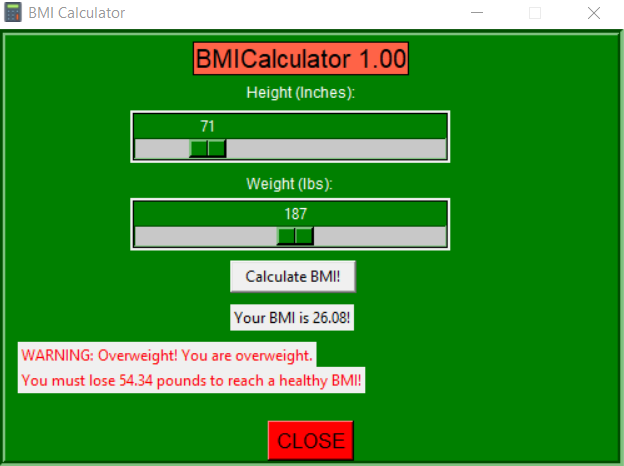

# BMICalculator

 Using Tkinter, I created a simple and convenient GUI that allows you to find your BMI by entering your height and weight in both the metric and the imperial system. 
 
  **Preview:**
 
 
 
 
 **For Users:**
 
 1. Download the .exe file and open the program. 
 
 2. Use the scrollbars to find your height and weight
 
 3. Click 'Calculate BMI' button

 
 
